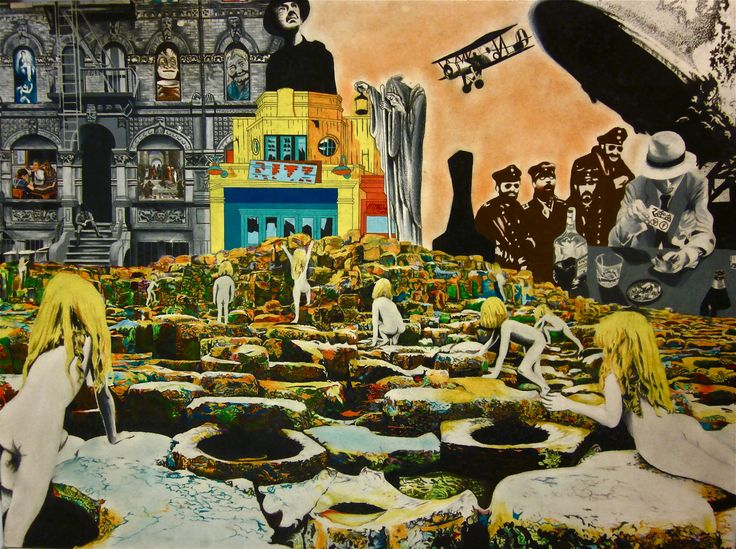



---

You have failed as citizens of your castes in the Hegemony's capital.
Since then, you have accumulated enormous debts with one of the capital's factions.

But your debts were collected by a Financier from the North.
This pioneer issued a permit to export to the Violet City in the northern steppes.
Upon arriving in the Violet City, you can still acquire an import permit to return to the Hegemony.
But this will cost £3,500.

***Versão em Português***
{: .text-right}

Vocês falharam como cidadãos das suas castas, na capital da Hegemonia. Desde então, vocês acumularam débitos altíssimos com uma das facções da capital. 

Mas seus débitos foram coletados por um Financier do Norte. Esse pioneiro emitiu uma permissão para exportar para a Cidade Violeta nas estepes do norte. Ao chegarem na Cidade Violeta, vocês ainda podem adquirir uma permissão de importação, para voltarem para a Hegemonia. Mas isso vai custar £ 3.500.

---
## Appendix N

### art board

<iframe style="border-radius:12px" src="https://petracoding.github.io/pinterest/board.html?link=estevaoseco/charged/&hideHeader=1&hideFooter=1&transparent=1" width="100%" height="652" frameBorder="0" style="color-scheme: site" allowfullscreen=""></iframe>

### playlist

<iframe style="border-radius:12px" src="https://open.spotify.com/embed/playlist/3sTCMlmuKBhgN1OSUWzxGd?utm_source=generator" width="100%" height="352" frameBorder="0" allowfullscreen="" allow="autoplay; clipboard-write; encrypted-media; fullscreen; picture-in-picture" loading="lazy"></iframe>

---
# System

***Failed Exports*** is a **Cairn 2e** campaign, using alternative backgrounds.  
**Cairn 2e**'s <a href="https://cairnrpg.com/second-edition/" target="_blank">website version</a> and <a href="https://drive.google.com/file/d/1b8mFMxYSdlwrsfwhT0CNalPoW9gdl5uE/view?usp=drivesdk" target="_blank">PDF version</a> are available for free.

  

    <b>Click to create a character</b>  
  

---

  <iframe
    src="https://null.perchance.org/chargedrpg"
    style="border:none; width:90%; height:100%;"
    allowfullscreen
  ></iframe>

