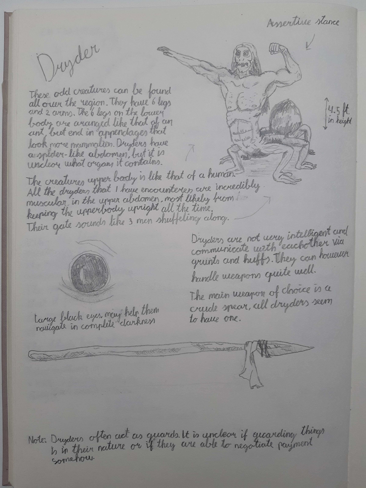



`=map(this.images, (x) => "")`


- Speak a guttural unknown language.
- Chest height, light in weight
- Bodies are weak to corrosive substances, like chalk.
- Very resistant to fire.

# Scientific Inquiry and Journaling

> by [Prof Dr Gary](../Deverain/Gary.md)

